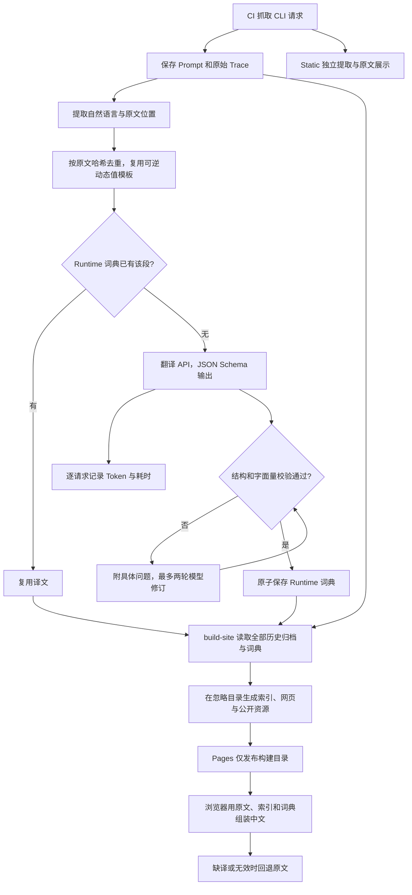

# 翻译范围、数据结构与数量审计

本次按约定只翻译 Runtime：历史 Prompt 和 Trace 中的自然语言。**Static 完全不翻译**，已删除 Static 译文词典及其 49 个专用源索引；原始 Static 归档继续供查看和比较。以下是 2026-09-06 回填验收时的统计，覆盖 14 个 Agent 的 1,229 份运行时快照，不代表 1,229 份各不相同的完整提示词。段数按各 Agent 词典内去重后相加；跨 Agent 完全相同的原文仍各自缓存，便于页面按需加载。全站不同原文哈希实际为 11,128 个。

后续目录调整将源索引和网页 HTML 移出 Git，改为构建时生成。原始归档和已付费得到的共享词典继续保存；这次调整不需要重新翻译。

## 当前覆盖率

| 范围 | 唯一翻译单元 |
| --- | ---: |
| 每个 Agent 最新默认版本的 Prompt，仅作参考 | 4,253 |
| 所有历史版本及变体的 Prompt | 12,262 |
| 加入 Trace，并复用可逆动态值模板后 | **12,494** |
| 当前已有可用结果，含应保留的标识符 | **12,494** |
| 剩余待翻译 | **0** |

本轮补齐此前缺少的 **9,099 个单元、1,443,349 原文字符**，其中 59 条回填前已审读的试译直接复用。这些单元可能是标题、列表项、正文段落或工具参数说明，既不是完整提示词数量，也不是 API 请求次数。相同段落跨版本复用；只改一段，就只新增该段的翻译。

| Agent | 历史运行时段 | 已可用 | 待译 |
| --- | ---: | ---: | ---: |
| antigravity | 375 | 375 | 0 |
| claude-code | 2,004 | 2,004 | 0 |
| codex | 974 | 974 | 0 |
| dsh | 305 | 305 | 0 |
| grok | 1,026 | 1,026 | 0 |
| hermes | 762 | 762 | 0 |
| kimi | 437 | 437 | 0 |
| kimi-code | 721 | 721 | 0 |
| mimo | 741 | 741 | 0 |
| minimax-code | 1,237 | 1,237 | 0 |
| omp | 1,448 | 1,448 | 0 |
| openclaw | 1,773 | 1,773 | 0 |
| opencode | 489 | 489 | 0 |
| pi | 202 | 202 | 0 |

回填基线是 1,228 份快照。随后 CI 实际抓取新增 Claude Code 2.1.263，Prompt 仅版本标记变化；新增两个源索引，正文全部复用已有译文，唯一翻译单元仍是 12,494。新增文档已重新提取并通过全库完整性审计。

覆盖率表示原文能找到通过结构校验的结果，不等于每一段都经过逐字语义审读。实际审读范围见 [翻译评测](translation-evaluation.md)，用量及预算见 [费用审计](translation-cost.md)。

## 什么翻，什么保留

| 内容 | 处理方式 |
| --- | --- |
| Runtime 系统/开发者指令、工具和参数说明、自然语言标题 | 翻译 |
| 示例中的解释性自然语言 | 翻译，保留必须精确输入或匹配的字面量 |
| Harness、产品名、工具名、函数名、参数名、JSON 键 | 保留名称，翻译周围说明 |
| 路径、URL、模型 ID、模板变量、数字约束 | 保留值；仅动态采集值可通过绑定复用译文 |
| 代码围栏中的代码及代码注释 | 原文，不调用翻译 API |
| 已有中文、纯标识符 | 保留原文 |
| Static 包内提示词、技能及 unknown 候选 | 全部保留原文，不进入翻译链路 |
| 原始请求 JSON | 原始视图不改；Trace 阅读视图中的说明字段可以翻译 |
| 缺译、索引过期、占位符无效 | 当前段或对应 diff 块回退原文 |

模型依据上下文决定技术术语和普通表达的边界。工程代码负责原文定位、复用和结构校验，不逐句修补译文。发现质量问题后，用具体反馈要求模型修订，再人工核对。

## 之前为什么有三万多段

原队列为 **32,690 个唯一单元**：全部历史 Prompt 12,262，加 Trace 独有原文 3,371，再加 Static 独有原文 17,057。Static 自身有 17,801 段，其中 744 段也出现在 Runtime；不能把它们加两次。

1. **历史和变体确实比最新主提示词多。** 最新 14 份默认 Prompt 是 4,253 段，而全部历史 Prompt 是 12,262 段。工具说明、参数说明也在范围内，不只是开头的系统指令。
2. **Trace 动态路径曾制造重复。** Prompt 已归一化临时目录，Trace 则保留真实路径。同一句话因路径不同得到不同哈希。现在只在能够逐字还原原文时复用模板，Runtime 从 15,633 降至 12,494 段；加入 Trace 后比历史 Prompt 只多 232 段。
3. **Static 是另一个很大的档案库。** 它收录包内不同用途的文本，不是每次运行都会使用的主提示词；如今整体退出翻译范围。
4. **Static 还曾误收程序资源。** 一份 Mermaid JavaScript bundle 拆成 1,001 段、约 295 万待译字符，另有网页和程序模板。通用静态提取过滤已改进；原始候选不重写。这些资源没有已保存译文，不能把历史费用归咎于它们。

Static 删除前已有 5,557 个缓存段，其中 744 个同时用于 Runtime，另 4,813 个为 Static 独占。删除整个 `static.json`，同时保留 Runtime 词典中用于运行时页面的共同内容。

## 译文存在哪里

```text
captures/<agent>/<version>/variants/<variant>/
  prompt.md                         规范化原文
  trace.jsonl                       原始请求证据

translations/
  zh-CN/<agent>/runtime.json         该 Agent 跨版本共享的运行时词典

.phistory-cache/site/               构建产物，不提交 Git
  index.html                        网页与运行时 manifest
  captures/...                      公开归档的副本
  translations/
    sources/<原文件 SHA-256>-v2.json 定位原文的源索引
    zh-CN/<agent>/runtime.json       发布的共享词典副本
```

词典的 `entries` 以原文段落哈希为键。每项保存中文 `text`、模型、统一翻译提示词版本和请求的思考预算；新条目另带 `translated` / `preserved` 状态，历史缺少状态字段的 2,437 条记录仍有效，审计中标为 legacy。没有为每个版本另存完整中文提示词。模型使用的翻译指令只在 `phistory/translation/prompts.py` 中维护。

`translate` 只保存共享词典。`build-site` 读取全部历史原档和词典，生成网站需要的源索引与 manifest，并复制公开资源到输出目录。构建不读取翻译凭据、不调用模型、不改原档或词典；删除输出目录后可以无费用重建。仓库内的 `captures/index.json` 只负责归档元数据，中文可用性在网页构建时关联。

源索引不存译文：Prompt 索引记录原文件哈希和段落 `id/start/end/kind`；Trace 索引另有记录序号和 JSON Pointer。可逆动态值通过 `bindings` 保存，例如当前文件的 `$PHISTORY_WORKSPACE` 对应哪条真实路径。浏览器验证占位符数量后代入该文件自己的值，最后进行 JSON 转义；无法完整还原就使用原文。

段落身份版本与索引提取版本分开。改进原文定位可升级索引，不会强制重译所有未改动的段落；上下文用于首次翻译消歧，不进入原文哈希。

## 文件多和“空文件”是怎么回事

原实现把 **2,010 个源索引和 14 个非空 Runtime 词典，共 2,024 个翻译数据文件**都提交到 Git。2,458 份 Prompt/Trace 文档中，完全相同的源文件共用索引。源索引约 109.7 MB，词典合计约 4.8 MB；索引体积来自历史版本的位置引用，不等于模型调用量。

现在 Git 中只保留 **14 个 Runtime 词典**。2,010 个可重建源索引和网页 HTML 移到构建输出，Pages 上传该目录。源索引仍是网站按需获取的静态资源，不再占据日常代码审查和提交列表。这个调整不重写过去的 Git 历史；旧提交仍能查看原来的索引文件。

14 个词典共保留 12,494 条当前归档实际引用的记录。本轮按全量历史归档清理了 1,237 条无引用缓存（Antigravity 132、Claude Code 643、Codex 462）和 2 个被最新 OpenClaw 归档替代的源索引。清理不修改原始 Prompt 或 Trace。

首次回填的翻译目录没有 0 字节文件、空词典或空源索引。原 PR 中有三种容易误认的显示：旧 `*-v1.json` 删除后的右侧为空；对应的当前位置索引是 `*-v2.json`；较大单行 JSON 的 diff 会被 GitHub 省略。这次构建目录迁移会显示那些源索引的删除；它们不再作为仓库源文件维护，网站会在构建时重新生成。

## 抓取、翻译、网页链路



修订有上限；失败项保持缺译，成功项及时保存。限流与暂时网络错误使用独立的有界重试，永久错误停止调度新请求。Static 不进入翻译 API 或词典。

原文决定 diff 变化范围。语言偏好保存在浏览器，不增加 URL 参数；Static 隐藏语言按钮，切回 Runtime 后恢复偏好。CI 抓取完成后只翻译最新十个已归档版本中的缺失段落；网站构建始终覆盖全部历史版本。API 用量 JSONL 单独上传为 CI artifact，不放进网页或译文词典。

网页从同一域名获取原档、当前文档的索引和对应 Agent 的共享词典，例如 `https://phistory.cc/translations/sources/<hash>-v2.json` 与 `https://phistory.cc/translations/zh-CN/codex/runtime.json`。它不请求翻译供应商。索引并非全量下载：首次中文 Diff 通常请求两份原文、两个索引和一个词典，切换同 Agent 的其他版本复用词典。

复现统计：`uv run phistory translate --all-captured --dry-run`，不调用 API、不改数据。构建、完整性检查与本地预览使用同一输出目录：

```bash
uv run phistory build-site --output .phistory-cache/site
uv run python scripts/audit_translations.py --site-dir .phistory-cache/site --require-complete
python -m http.server --directory .phistory-cache/site
```

## 2026-09-06 构建目录迁移验证

删除 Git 中的 2,010 个源索引和根目录生成的 `index.html`，保留 14 份共享词典及全部原始归档。新构建产出的全部索引、词典和网页 HTML 与迁移前逐字节一致，因此不需要重新翻译。`captures/index.json` 去掉翻译描述，只保留归档信息。

263 项测试、Ruff 和 Python 包构建通过。全量 dry-run 复用 12,494 条词典记录，待翻译 0 条、API 请求 0 次。发布目录审计验证 1,020,116 处原文引用，缺译、缺索引和结构错误均为 0。新增构建测试覆盖无密钥、缺译回退、原始换行保留、目录误覆盖保护、重建清理过期资源，以及发布副本与原始数据一致性。

仅从发布目录提供服务的浏览器验收覆盖桌面和手机的 14 个 Agent：28 次历史中文 Diff、56 次两端 Trace、112 次源索引读取、6 轮 Static 往返及 4 次缺译/过期索引回退均通过。页面、控制台和资源请求错误为 0；截图检查确认紧凑布局保持一致。

## 2026-09-06 回填验证记录

245 项测试、Ruff 格式与 lint、构建通过。14 个 Agent、21 个变体的全新本地抓取通过，翻译凭据未传入被抓取的 CLI。Antigravity 的旧占位归档已经使用上游 CloudCode 抓取修复重新采集；本轮另修正七个版本的 observed 元数据，让其反映主请求模型和工具数，原始请求证据不作展示性改写。

网页验收覆盖所有 Agent 的早期与最新 Runtime，在桌面与手机上检查中文 Diff、Trace、缺译回退、Static 切换和 URL。原文决定 diff，语言偏好只在浏览器保存；Static 保持原文并不请求翻译文件。详细验收结果见 [翻译评测](translation-evaluation.md)。
