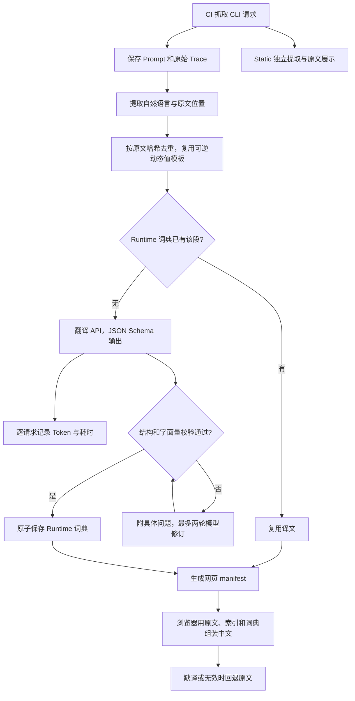

# 翻译范围、数据结构与数量审计

本次按约定只翻译 Runtime：历史 Prompt 和 Trace 中的自然语言。**Static 完全不翻译**，已删除 Static 译文词典及其 49 个专用源索引；原始 Static 归档继续供查看和比较。以下统计针对 14 个 Agent 的 1,228 份运行时快照，不代表 1,228 份各不相同的完整提示词。

## 当前要翻多少

| 范围 | 唯一翻译单元 |
| --- | ---: |
| 每个 Agent 最新默认版本的 Prompt，仅作参考 | 4,253 |
| 所有历史版本及变体的 Prompt | 12,262 |
| 加入 Trace，并复用可逆动态值模板后 | 12,494 |
| 当前已有可用译文 | 3,395 |
| 剩余待翻译 | **9,099** |

剩余原文共 **1,443,349 字符**。这里的“段”可能是标题、列表项、正文段落或工具参数说明，既不是完整提示词数量，也不是 API 请求次数。相同段落跨版本复用；只改一段，就只新增该段的翻译。

| Agent | 历史运行时段 | 已可用 | 待译 |
| --- | ---: | ---: | ---: |
| Antigravity | 375 | 351 | 24 |
| Claude Code | 2,004 | 2,001 | 3 |
| Codex | 974 | 971 | 3 |
| DSH | 305 | 36 | 269 |
| Grok | 1,026 | 0 | 1,026 |
| Hermes | 762 | 0 | 762 |
| Kimi | 437 | 0 | 437 |
| Kimi Code | 721 | 0 | 721 |
| MiMo | 741 | 0 | 741 |
| MiniMax Code | 1,237 | 0 | 1,237 |
| OMP | 1,448 | 0 | 1,448 |
| OpenClaw | 1,773 | 36 | 1,737 |
| OpenCode | 489 | 0 | 489 |
| Pi | 202 | 0 | 202 |

这些数字是删除 Static 后、正式续跑前的快照。本轮成本实验结果仅保存在忽略目录，不算生产译文，不改变覆盖率。费用测算见 [翻译费用审计](translation-cost.md)。

## 什么翻，什么保留

| 内容 | 处理方式 |
| --- | --- |
| Runtime 系统/开发者指令、工具和参数说明、自然语言标题 | 翻译 |
| 示例中的解释性自然语言 | 翻译，保留必须精确输入或匹配的字面量 |
| Harness、产品名、工具名、函数名、参数名、JSON 键 | 保留名称，翻译周围说明 |
| 路径、URL、模型 ID、模板变量、数字约束 | 保留值；仅动态采集值可通过绑定复用译文 |
| 代码围栏中的代码及代码注释 | 原文，不调用翻译 API |
| 已有中文、纯标识符 | 保留原文 |
| Static 包内提示词、技能及 unknown 候选 | 全部保留原文，不进入翻译链路 |
| 原始请求 JSON | 原始视图不改；Trace 阅读视图中的说明字段可以翻译 |
| 缺译、索引过期、占位符无效 | 当前段或对应 diff 块回退原文 |

模型依据上下文决定技术术语和普通表达的边界。工程代码负责原文定位、复用和结构校验，不逐句修补译文。发现质量问题后，用具体反馈要求模型修订，再人工核对。

## 之前为什么有三万多段

原队列为 **32,690 个唯一单元**：全部历史 Prompt 12,262，加 Trace 独有原文 3,371，再加 Static 独有原文 17,057。Static 自身有 17,801 段，其中 744 段也出现在 Runtime；不能把它们加两次。

1. **历史和变体确实比最新主提示词多。** 最新 14 份默认 Prompt 是 4,253 段，而全部历史 Prompt 是 12,262 段。工具说明、参数说明也在范围内，不只是开头的系统指令。
2. **Trace 动态路径曾制造重复。** Prompt 已归一化临时目录，Trace 则保留真实路径。同一句话因路径不同得到不同哈希。现在只在能够逐字还原原文时复用模板，Runtime 从 15,633 降至 12,494 段；加入 Trace 后比历史 Prompt 只多 232 段。
3. **Static 是另一个很大的档案库。** 它收录包内不同用途的文本，不是每次运行都会使用的主提示词；如今整体退出翻译范围。
4. **Static 还曾误收程序资源。** 一份 Mermaid JavaScript bundle 拆成 1,001 段、约 295 万待译字符，另有网页和程序模板。通用静态提取过滤已改进；原始候选不重写。这些资源没有已保存译文，不能把历史费用归咎于它们。

Static 删除前已有 5,557 个缓存段，其中 744 个同时用于 Runtime，另 4,813 个为 Static 独占。删除整个 `static.json`，同时保留 Runtime 词典中用于运行时页面的共同内容。

## 译文存在哪里

```text
captures/<agent>/<version>/variants/<variant>/
  prompt.md                         规范化原文
  trace.jsonl                       原始请求证据

translations/
  sources/<原文件 SHA-256>-v2.json   定位原文的源索引
  zh-CN/<agent>/runtime.json         该 Agent 跨版本共享的运行时词典
```

词典的 `entries` 以原文段落哈希为键。每项保存中文 `text`、模型、统一翻译提示词版本、请求的思考预算，以及 `translated` / `preserved` 状态。没有为每个版本另存完整中文提示词。模型使用的翻译指令只在 `phistory/translation/prompts.py` 中维护。

源索引不存译文：Prompt 索引记录原文件哈希和段落 `id/start/end/kind`；Trace 索引另有记录序号和 JSON Pointer。可逆动态值通过 `bindings` 保存，例如当前文件的 `$PHISTORY_WORKSPACE` 对应哪条真实路径。浏览器验证占位符数量后代入该文件自己的值，最后进行 JSON 转义；无法完整还原就使用原文。

段落身份版本与索引提取版本分开。改进原文定位可升级索引，不会强制重译所有未改动的段落；上下文用于首次翻译消歧，不进入原文哈希。

## 文件多和“空文件”是怎么回事

当前有 **2,008 个源索引、5 个非空 Runtime 词典，共 2,013 个翻译数据文件**。2,456 份 Prompt/Trace 文档中，完全相同的源文件共用索引。源索引约 109.6 MB，词典合计约 1.8 MB；数量和体积主要来自跨历史版本的段落位置引用，不等于待调用模型的文本量。

五个词典属于 Antigravity、Claude Code、Codex、DSH 和 OpenClaw。词典内共 4,632 条记录，包含归一化前仍保留的旧缓存；其中 3,395 条命中当前队列。尚无翻译结果的 Agent 不创建空词典占位。

翻译目录没有 0 字节文件、空词典或空源索引。Git 中旧 `*-v1.json` 的删除记录可能显示空白右侧；对应当前文件是重建后的 `*-v2.json`，不是生成了空文件。本轮另删除 Static 专用索引和词典，原始 captures 不因此改变。

## 抓取、翻译、网页链路



修订有上限；失败项保持缺译，成功项及时保存。限流与暂时网络错误使用独立的有界重试，永久错误停止调度新请求。Static 不进入翻译 API 或词典。

原文决定 diff 变化范围。语言偏好保存在浏览器，不增加 URL 参数；Static 隐藏语言按钮，切回 Runtime 后恢复偏好。CI 抓取完成后翻译最新十个已归档版本，随后重新生成 manifest 和网页。API 用量 JSONL 单独上传为 CI artifact，不放进网页或译文词典。

复现统计：`uv run phistory translate --all-captured --dry-run`，不调用 API、不改数据。完整性检查：`uv run python scripts/audit_translations.py`。全量回填仍待执行，本次只清理 Static、核查历史费用和少量采样。

## 本轮验证

236 项测试、Ruff 格式与 lint、构建通过。离线审计确认 2,008 个源索引无缺失、无结构错误；原始 capture 文件未改动，只有生成的 manifest 更新。

桌面 1440px 和手机 390px 各完成三轮 Static → Diff → Trace 切换：Static 保留 1,887 个原文章节，不请求翻译资源；Runtime 样例的 1,102 段均使用已有译文，模拟空词典时全部回退原文。语言偏好保留，URL 无语言参数，页面异常为零。额外修复了大篇幅 Static 切回 Runtime 的 Monaco 异步行号异常：每次比较独立管理只读文本模型和 diff view 的生命周期，及时释放旧比较；反复切换时 Diff/Static 保持两个文本模型，Trace 为零，无累积。

上述浏览器测试验证功能与回退，不表示尚缺的 9,099 段已回填或通过人工语言质量验收。本次新译文仅在实验目录，代码和数据尚未发布。
